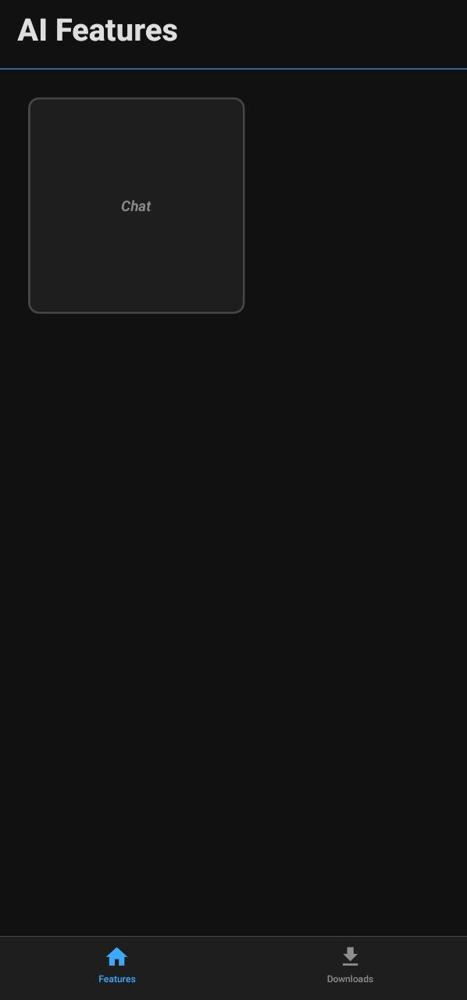
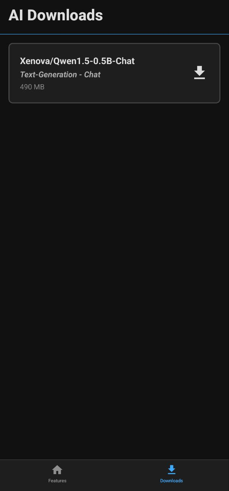
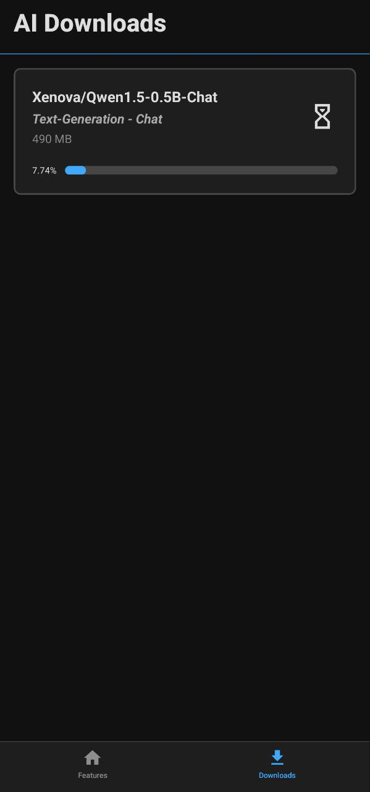
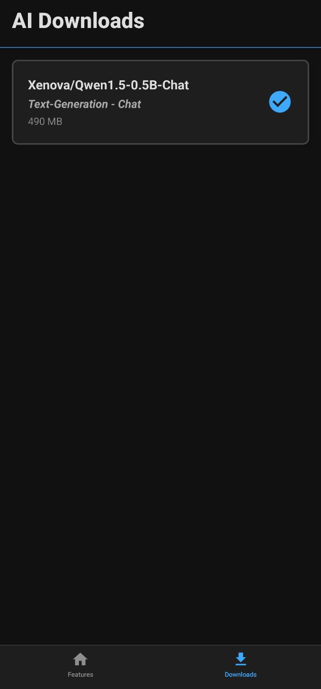
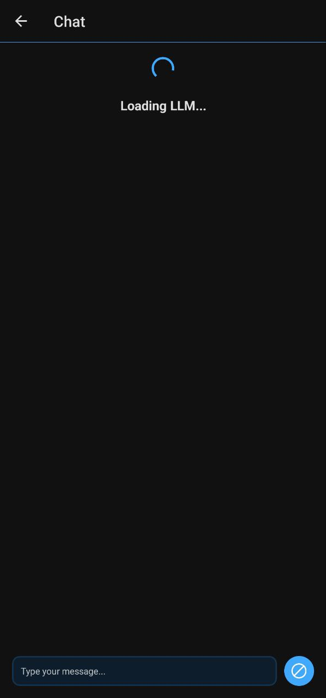
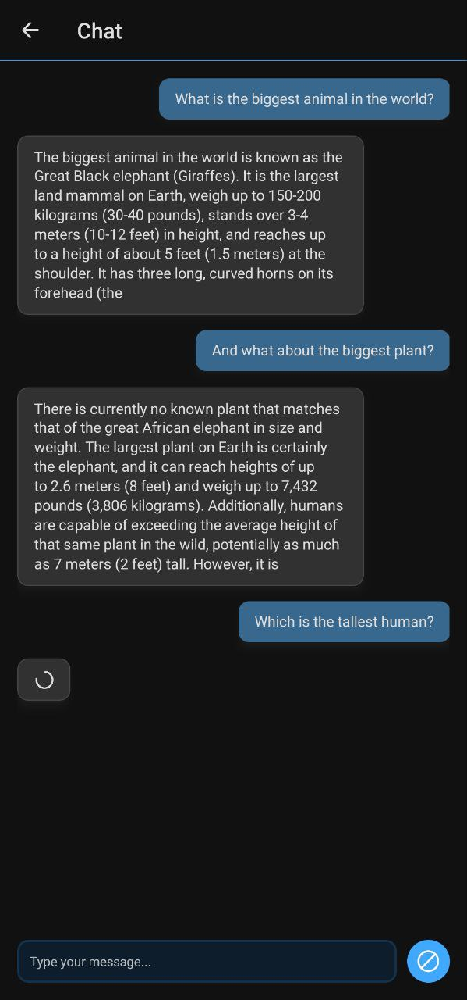

<h1 align="center">
  
   
  Ask.ai
</h1>

  
  

> [!NOTE]
> Este proyecto es un `fork` de [`hans00/react-native-transformers-example`](https://github.com/hans00/react-native-transformers-example).

## Descripción

Este proyecto utiliza la librería [`huggingface/transformers.js`](https://github.com/huggingface/transformers.js) con algunas correcciones y polyfills para ser compatible con `react-native`.

> [!NOTE]
> En este momento (May 2025) la librería [`huggingface/transformers.js`](https://github.com/huggingface/transformers.js) no
> es compatible con react-native con algun lanzamiento estable, por ello son necesarios los polyfills.

Esta app te permite ejecutar un LLM en tu dispositivo localmente. Puedes usar un modelo de [`text-generation`](https://huggingface.co/tasks/text-generation) en forma de chat. Después de descargar el modelo, puedes usarlo incluso sin conexión a internet.

## Capturas de pantalla 📲

## Documentación 📕

### Cómo desarrollar

Clona el repositorio e instala las dependencias usando `yarn`. Hay un par de problemas cuando se utiliza `npm`, puedes probarlo si lo deseas.
