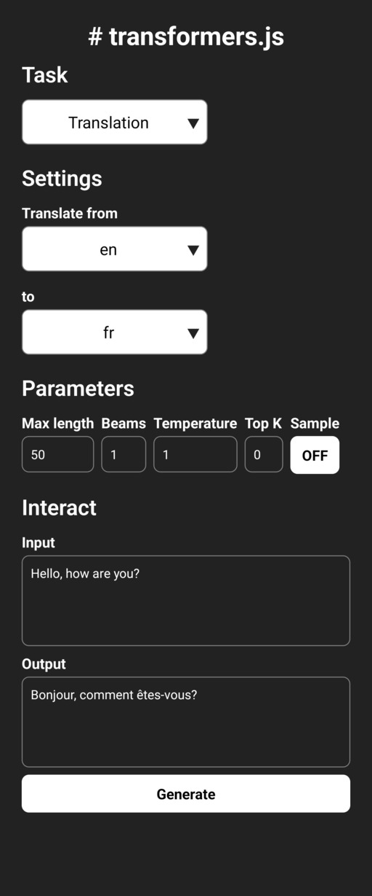

# Transformers.js examples for ReactNative



[How to develop](DEVELOPMENT.md)

```bash
#result of: npx react-native-rename@latest "AskAI" -b "com.ismacortgtz.askai"

ios/transformers_example NOT RENAMED
ios/AskAI/transformers_example.entitlements NOT RENAMED
ios/AskAI/transformers_exampleRelease.entitlements NOT RENAMED
ios/transformers_example-tvOS NOT RENAMED
ios/transformers_example-tvOSTests NOT RENAMED
ios/transformers_example.xcworkspace NOT RENAMED
ios/transformers_exampleTests NOT RENAMED
ios/AskAITests/transformers_exampleTests.m NOT RENAMED
ios/transformers_example.xcodeproj NOT RENAMED
ios/AskAI.xcodeproj/xcshareddata/xcschemes/transformers_example-tvOS.xcscheme NOT RENAMED
ios/AskAI.xcodeproj/xcshareddata/xcschemes/transformers_example.xcscheme NOT RENAMED
ios/transformers_example-Bridging-Header.h NOT RENAMED
ios/Podfile UPDATED (2 matches)
ios/transformers_example/AppDelegate.mm UPDATED (1 match)
ios/transformers_example.xcodeproj/project.pbxproj UPDATED (94 matches)
ios/transformers_example.xcworkspace/contents.xcworkspacedata UPDATED (1 match)
ios/transformers_example.xcodeproj/xcshareddata/xcschemes/transformers_example.xcscheme UPDATED (10 matches)
ios/transformers_exampleTests/transformers_exampleTests.m NOT UPDATED (0 matches)
ios/transformers_example.xcodeproj/project.pbxproj UPDATED (52 matches)
ios/transformers_exampleTests/transformers_exampleTests.m UPDATED (2 matches)
ios/transformers_example.xcodeproj/xcshareddata/xcschemes/transformers_example.xcscheme UPDATED (2 matches)
ios/transformers_example.xcodeproj/project.pbxproj UPDATED (22 matches)
ios/transformers_example.xcodeproj/project.pbxproj UPDATED (0 matches)
ios/transformers_example/LaunchScreen.storyboard UPDATED (1 match)
ios/transformers_example/Info.plist UPDATED
android/app/src/main/java/com/ismacortgtz/askai RENAMED
android/settings.gradle UPDATED (1 match)
android/app/src/main/java/com/ismacortgtz/askai/MainActivity.kt UPDATED (1 match)
android/app/build.gradle NOT UPDATED (0 matches)
android/app/build.gradle UPDATED (2 matches)
android/app/src/main/java/com/ismacortgtz/askai/MainActivity.kt UPDATED (1 match)
android/app/src/main/java/com/ismacortgtz/askai/MainApplication.kt UPDATED (1 match)
android/app/src/main/AndroidManifest.xml NOT UPDATED (0 matches)
android/app/src/main/res/values/strings.xml UPDATED
index.js NOT UPDATED (0 matches)
package.json UPDATED (1 match)
app.json UPDATED (4 matches)
Done removing builds.

SUCCESS! 🎉 🎉 🎉 Your app has been renamed to "AskAI".

- Make sure to check old .xcodeproj and .xcworkspace in ios folder, please delete them manually.
- Please make sure to run "npx pod-install" and "watchman watch-del-all" before running the app.

If you like this tool, please give it a star on GitHub: https://github.com/junedomingo/react-native-rename

```
